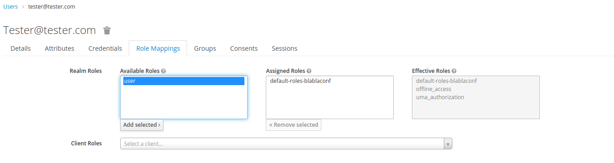

This demo illustrates the usage of keycloak to secure several service accross different clients using roles. 

# How to Run:

From a terminal you need to run: `docker-compose up`

Important: You need to add `keycloak` host name to your hosts file (/etc/hosts for linux) and map it to localhost.

# Showcase roles usage:

you can navigate to `localhost:8081` and register a new user. On login, you will notice that the ui is returning the following:

This means the user lacks the permissions to fetch the data: Navigate to keycloak admin: localhost:8080/auth ->   users -> your user -> roles mappings tab

logout manually from the current session and navigate back to `localhost:8081` again. You will notice that now the app now fetches the  data:

# Testing emails

keycloak is configured to send emails to mailhog. You can navigate to `localhost:8025` to find all the sent emails from keycloak:

